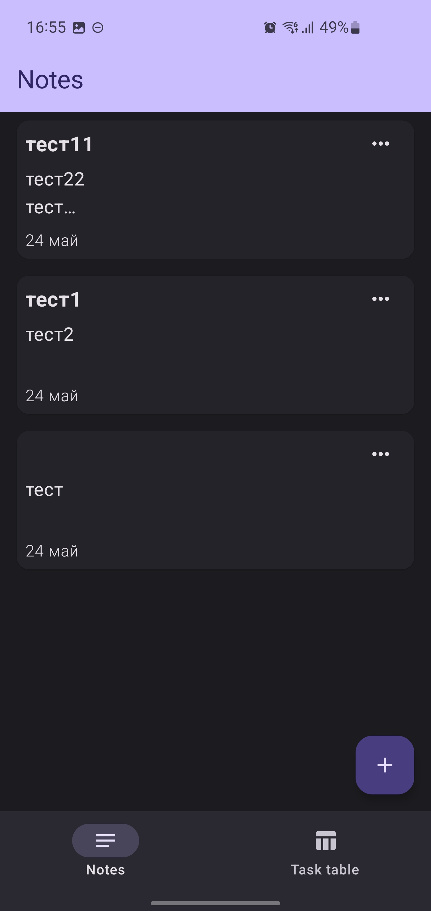
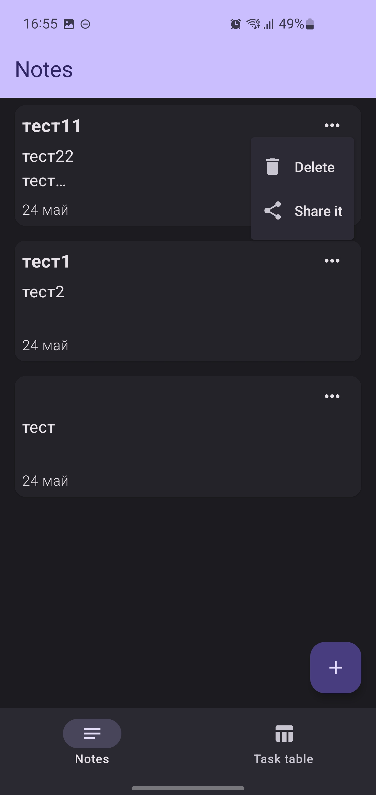
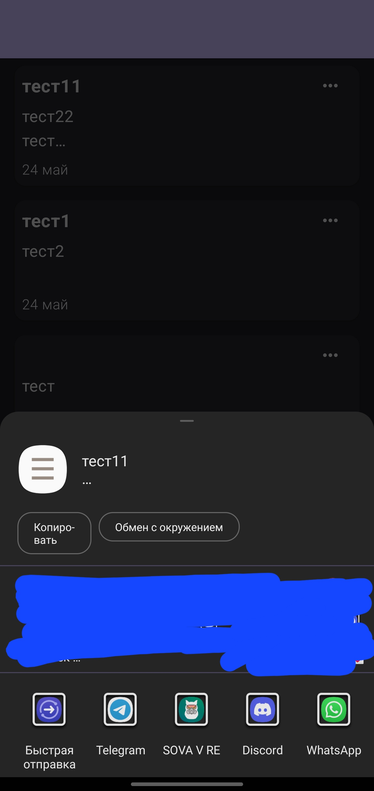
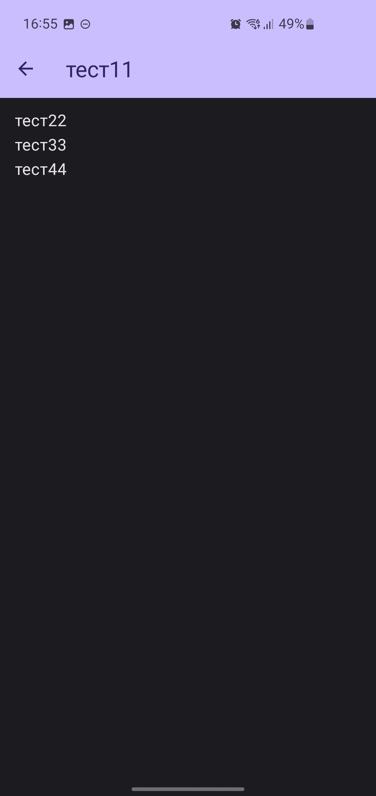
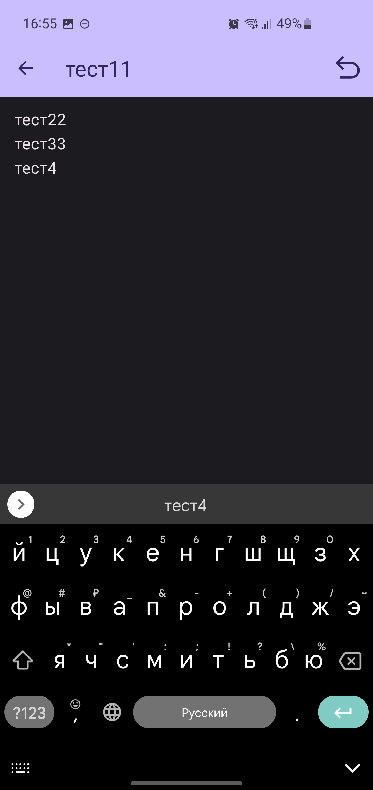
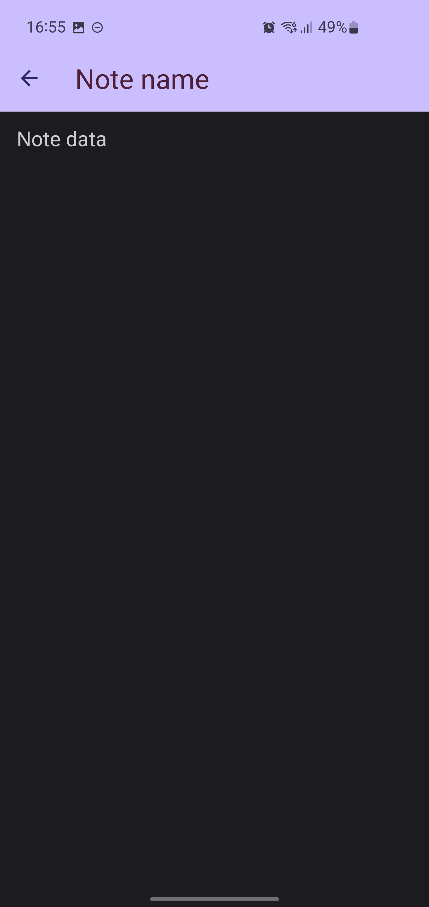

# Notes & TODO

Пет проект приложения для заметок и таблицы задач (на данный момент реализованы только заметки). Заметки хранятся в локальной базе данных SQLite с использованием Room, запросы осуществляются в корутинах. Для инъекции зависимостей используется Hilt. UI сделан на Jetpack Compose с дизайном Material You и поддержкой Dynamic Colors. Архитектура приложения MVVM.
В планах есть добавление многомодульности с отдельными модулями заметок и таблицы задач, а также улучшение анимаций при навигации.

## Стек
 - Kotlin
 - MVVM
 - Clean Architecture
 - Jetpack Compose
 - Material You(3)
 - AndroidX Navigation
 - Kotlin StateFlow
 - Hilt
 - Room
 - Многомодульность
## Скриншоты

